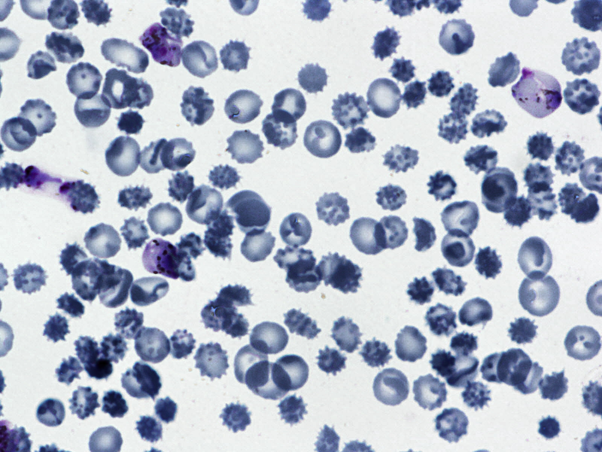
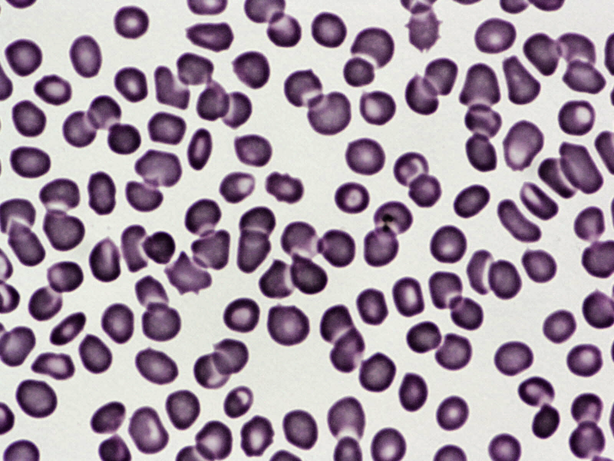

# ML Malaria Detection with SIFT Features
Machine Learning Python code that can detect malaria & malaria infected cells (trophozoites, rings, scizonts, infected gametocytes) in wholeslide microscopy images

 Sample Images:

  
   

<b>Final paper.pdf</b> : the paper submitted for ECE 687 Pattern Recognition at Drexel University 2019 including comparative analysis of this project and current state of the art

<b>Malaria Detection.pptx</b>: PowerPoint summarizing Final Paper.pdf

<b>NeuralClass.py</b>: Contains the Artificial Neural Net (ANN) used in the NeuralN.py file. Created using Pytorch.

<b>NeuralN.py</b>: Uses the ANN created in the NeuralClass.py file for detection of malaria and malaria infected cells in wholeslide microscopy images. Maximum accuracy: 92.81, F-score: 96.25

<b>LBP.py</b>: (Local Binary Pattern) contains the algorithm that converts a grayscale image to a local binary pattern image

<b>SVM.py</b>: contains both Support Vector Machine (SVM) and Random Forest Classifier used for this dataset with and without Principal Component Analysis (PCA). SVM, Random Forest, PCA from SkLearn Python package.
SVM and Random Forest Classifier respectively: Maximum accuracy: NA (didn't converge), F-score: NA (didn't converge), Maximum accuracy: 81.89, F-score: 89.32 

plotInfectedCells.py: plots RGB of dataset, PCA histograms using Matplotlib
 

